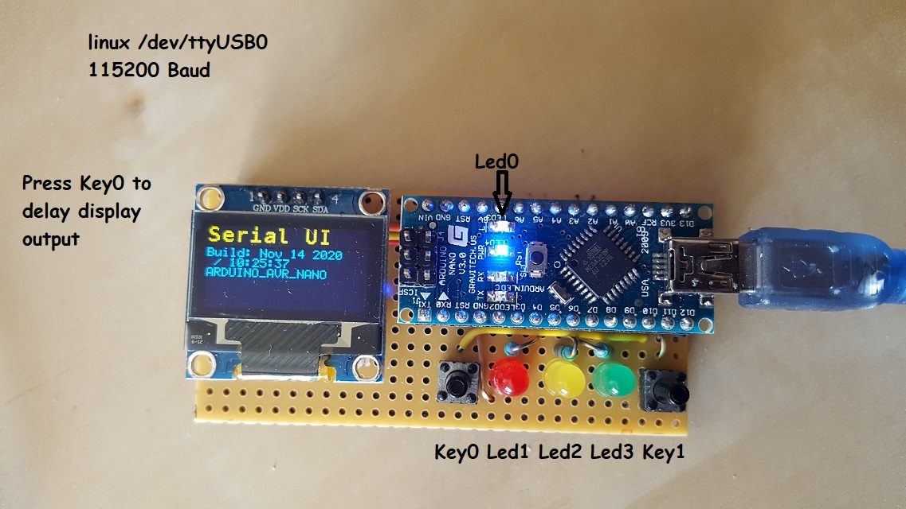

# 24 V Balancer (2x12V)
Arduino UNano V3.0 mit OLED display
DC/DC Wandler 24V /5V galvanisch getrennt.

## Verbindung über Console 

### Debuggen
UART Settings: 115200 Baud, SERIAL_8N1 (the default)

# Serial Kommandos
## Auswahl Modus

    0,1,2,3 = select led, command is modal
    x = off
    o = on

    f = flash sequence 10 times fast (only for test usefull)

    h = this help

    s [0-9] /CR/LF = set hysterese in mV

## Setzen der Hysterese

## Display Commands
To switch to balancer mode use '@' (default)
With '#' you can change to force the aouputs or leds

    # = switch to led command
    @ = switch to oled output
    
  
# Wiring
## led's
    Led0 = BUILD IN LED
    Led1 = D5 --> select battery 1 ore 2
    Led2 = D6 --> switch on load to reduce the voltage of selected battery
    Led3 = D7 --> not used

## key's not used
    Key0 = 11; //D11;
    Key1 = 12; //D12;

## OLED Display Wiring

### Arduino Nano
> Old Boot loader !!!  
> "board": "arduino:avr:nano"  
> "configuration": "cpu=atmega328old"  

    I2C Bus:
    SDA = A4
    SCL = A5

### Analog in

    Battery Mesasure = A0 

    Resistor 1k/2k --> 15V --> 5V

# TIPS for beginners
## work with GIT
    push --> commit to GIT   
    pull --> get from GIT

use commandos in VScode :-)
